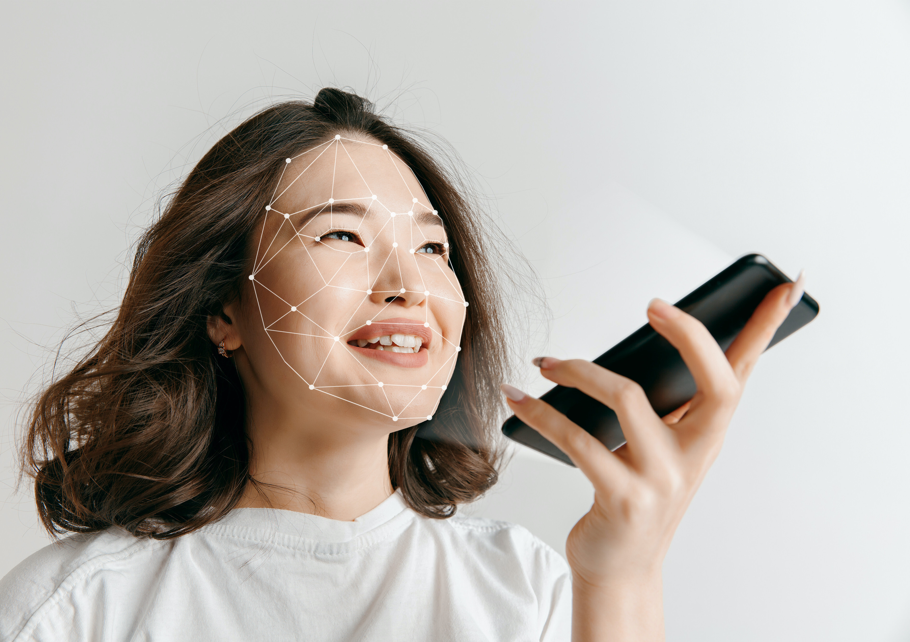

La desinformación y las [fake news](https://es.wikipedia.org/wiki/Fake_news) son una herramienta de influencia poderosa y no precisamente costosa que puede llegar a destruir la confianza en la sociedad.

## ¿Qué son los "Deepfakes"?

Los ["Deepfakes"](https://es.wikipedia.org/wiki/Deepfake) son el resultado de aplicar técnicas de inteligencia artificial que permiten, mediante el uso de algoritmos de aprendizaje, recrear de manera virtual la imagen, voz, e incluso los gestos de una persona. El resultado final del uso de esta herramienta son vídeos o audios muy realistas (aunque falsos) en los que se encuentran a alguien haciendo o diciendo algo que en realidad no hizo ni dijo.

> > Los #deepfakes son un ejemplo claro de las repercusiones negativas que puede causar en nuestra sociedad un mal uso de la Inteligencia Artificial.

Los primeros vídeos que salieron a luz utilizando esta tecnología eran de carácter pornográfico, en los cuales se podía observar la cara de celebridades con el cuerpo de otra persona. Desde entonces se ha extendido el uso de esta tecnología a personajes de relevancia pública, tales como, políticos, empresarios, famosos, entre otros[^1].

Un ejemplo respecto al uso de _deepfakes_ con políticos es el vídeo subido en el canal de YouTube de BuzzFeedVideo en el cual se muestra al ex presidente de los Estados Unidos, Barack Obama, pronunciando las palabras del creador de dicho vídeo para demostrar lo fácil que es poner palabras en la boca de otra persona.

<iframe src="https://www.youtube.com/embed/cQ54GDm1eL0"></iframe>

El uso de aplicaciones como ZaoApp y FaceApp han hecho que las tecnologías de _deepfakes_ se extiendan y sean accesibles a cualquiera, puesto que lo único que necesitamos es un teléfono inteligente para descargarnos dichas aplicaciones.

Las herramientas para generar _deepfakes_ suelen ser gratuitas, fáciles de acceder y no necesitan conocimientos de programación para utilizarlas.

## ¿Cómo abordar el problema de los "Deepfakes" con la legislación existente?

En primer lugar, cabe indicar que muchas veces el uso de _deepfakes_ puede quedar amparado por la figura de la parodia regulada en el artículo 39 de la vigente Ley de la Propiedad Intelectual.

No obstante, existen otros supuestos en los que resulta evidente que se utilizan este tipo de técnicas para desacreditar, inducir a confusión y engaño, tergiversando la información o los acontecimientos con el objetivo de manipular la opinión pública. Muchas veces, incluso, si posteriormente se demuestra que las imágenes o vídeos son falsos, el daño a la reputación de la persona agraviada es irreparable.

Actualmente, <mark>en España no existe una regulación específica para abordar la problemática de los _deepfakes_</mark>. No obstante, la legislación vigente ofrece un marco jurídico aplicable para combatir este tipo de conductas, por ejemplo, en caso de que estemos ante un contenido original este podría estar protegido por los derechos de autor, el uso de información personal o confidencial podría quedar amparado bajo la normativa de protección de datos de carácter personal y a la normativa de competencia desleal, en caso de contenido difamatorio podemos acudir a la Ley Orgánica 1/1982 de 5 de mayo de protección civil del derecho al honor, a la intimidad personal y familiar, en caso de injurias y calumnias podemos acudir a lo tipificado en nuestro Código Penal.

<mark>Además de lo anterior, los **prestadores de servicios de la información** juegan un papel muy importante a la hora de detectar, controlar y evitar la difusión de _deepfakes_.</mark>

Actualmente, la mayor parte de las plataformas de distribución decontenidos, tales como, YouTube, Facebook o Twitter, cuentan con tecnologías para detectar contenido ilegal, inmoral, falsos o alterados, así como cuentan con mecanismos para denunciar este tipo decontenido y eliminarlo.

En este sentido, el pasado 5 de marzo de 2020, <mark>la red social de **Twitter** estableció una serie de reglas en su [Política relativa a los contenidos multimedia falsos y alterados](https://help.twitter.com/es/rules-and-policies/manipulated-media) en la cual se reserva una serie de derechos para evitar la difusión de este tipo de contenido</mark>.

## ¿Qué tecnologías podemos utilizar para hacer frente a los "Deepfakes"?

Actualmente, existen una serie de plataformas creadas para detectar _deepfakes_ tales como, por ejemplo, Defudger, Truepic, u otras. Algunas de estas plataformas utilizan la inteligencia artificial para su detección y otras hacen uso del Blockchain.

## ¿Sería recomendable prohibir el uso de los "Deepfakes"?

Tal y como ya hicimos mención, muchas veces el uso de _deepfakes_ no resulta problemático puesto que se crea como una sátira política, para crear efectos especiales en la televisión o el cine, como parodia, u otros usos legítimos.

No obstante, lo que preocupa a los legisladores es aquellos usos ilegítimos o socialmente perjudiciales pueden llegar a crear una desconfianza colectiva acerca de todo aquello que vemos y escuchamos. Dada esta preocupación algunos países como Estados Unidos, en concreto, los estados de Washington, California, Virginia, Texas, [han promulgado leyes para combatir el uso de deepfakes](https://blog.malwarebytes.com/artificial-intelligence/2020/01/deepfakes-laws-and-proposals-flood-us/).

<mark>Lo que resulta evidente es que no tenemos la certeza de que este tipo de regulaciones resulten efectivas y realmente ayuden a combatir el uso ilegítimo de los deepfakes.</mark> Una prohibición total de dichas herramientas impediría el uso legítimo de la utilización de la inteligencia artificial para recrear la imagen, voz y gestos humanos y, además, podría entrar en conflicto con las normas de libertad de expresión.

## Referencias

[^1]: Edvinas Meskys, Aidas Liaudanskas, Julija Kalpokiene, Paulius Jurcys, Regulating deep fakes: legal and ethical considerations, Journal of Intellectual Property Law & Practice, Volume 15, Issue 1, January 2020, Pages 24–31, [https://doi.org/10.1093/jiplp/jpz167](https://doi.org/10.1093/jiplp/jpz167)
