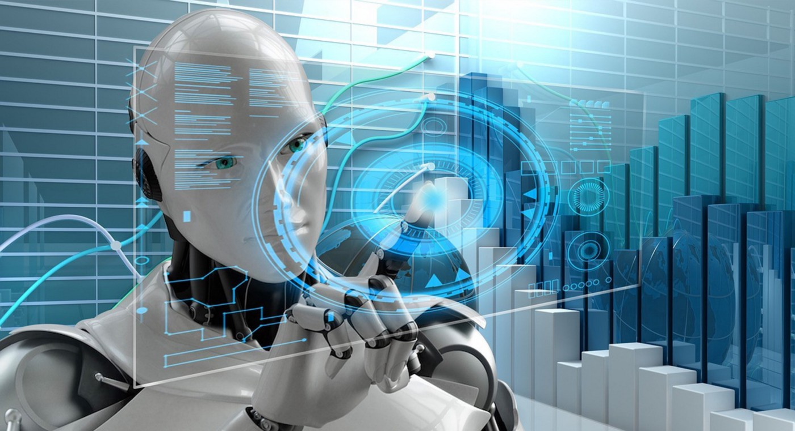

Aunque aún nos puedan parecer ciencia ficción, lo cierto es que los robots ya están aquí y han llegado para quedarse entre nosotros. Están apareciendo en diversas industrias, irrumpiendo en campos como la atención sanitaria, el transporte y el sector militar.

Cada día se están volviendo más autónomos, siendo capaces de tomar decisiones propias e implementarlas en el mundo exterior sin aportes externos.

## Hacia una realidad robótica

Han pasado ya años desde que se puso en marcha el bot _Random Darknet Shopper_, también conocido como _Randy_. Se trataba de un programa informático provisto de 100 bitcoins y capaz de realizar aleatoriamente compras online en la red oscura o _darknet_. No tardó en ser detenido - legalmente, confiscado - al incluir en su carrito de compra nada más y nada menos que un pasaporte húngaro y droga MDMA o éxtasis. En este caso, el proyecto _Randy_ tenía como objetivo lanzar a debate público las incógnitas legales que plantea la posible pérdida de control sobre tecnologías basadas en inteligencia artificial.

Los grados de autonomía de los robots que se están logrando rompen el concepto de estos como meras herramientas. Pero si no son herramientas, ¿qué son? Si algo sale mal con un sistema autónomo, ¿a quién le echaremos la culpa? ¿Hasta dónde ha de llegar la responsabilidad legal del fabricante de un robot delincuente? ¿Debe mitigar el riesgo poniendo cortapisas y límites a la autonomía y capacidad de toma de decisiones del robot? Si es así, ¿en qué medida y cómo afectará esto a la innovación? Todas estas cuestiones merecen una gran reflexión y sus respuestas tendrán un alto impacto en los años venideros en la industria de la innovación.

## Hacia el reconocimiento de la personalidad electrónica de los robots

Se ha comenzado a explorar, también a nivel de [regulación en la Unión Europea](https://www.europarl.europa.eu/news/en/press-room/20170110IPR57613/robots-legal-affairs-committee-calls-for-eu-wide-rules), la posibilidad de dotar a los sistemas de inteligencia artificial de personalidad jurídica. Lo cierto es que darles la consideración de “personas electrónicas” podría ayudar a dar solución algunas de las grandes incógnitas planteadas en este artículo. Conviene tener en cuenta que ya concedemos personalidad jurídica a entelequias, como a las empresas, a las que incluso les reconocemos responsabilidad penal por la comisión de delitos.

Dotar de personalidad a las máquinas autónomas más complejas podría traer seguridad jurídica al sector tecnológico, animándolo a innovar. Permitiría trazar un régimen de responsabilidad adecuado para los actos cometidos por robots, permitiendo señalar a los responsables. Asimismo, abriría la puerta a estudiar el tipo de penas que se podrían aplicar sobre los robots, tales como su reprogramación, su inhabilitación temporal o su destrucción total.

## Retos para la privacidad en la era de la inteligencia artificial

Los robots y sistemas autónomos procesan una inmensa cantidad de datos, incluyendo en muchos casos datos personales sensibles y especialmente protegidos tales como los biométricos. Una de las principales cuestiones en materia de privacidad viene de la mano del artículo 22 del Reglamento General de Protección de Datos, según el cual las personas, salvo en algunos casos tasados, tienen derecho a no ser objeto de decisiones basadas únicamente en tratamientos automatizados cuando produzcan efectos jurídicos o les afecten significativamente de modo similar.

En este sentido, puede ser muy complejo aplicar este derecho desde una perspectiva práctica, teniendo en cuenta que los sistemas de inteligencia artificial se diseñan precisamente con el objetivo de no permitir intervenciones humanas que puedan remplazar la toma de decisiones automáticas.

Asimismo, el cumplimiento de los principios de privacidad desde el diseño y por defecto fuerza a los fabricantes a diseñar sus sistemas de inteligencia artificial velando por la minimización de los datos tratados, su proporcionalidad, etc. Si bien esto es potencialmente perjudicial desde la perspectiva de los fabricantes, ya que limita el tratamiento de datos que puede realizarse a través de sus sistemas de IA (y su intercambio de datos con terceros), lo cierto es que ayuda a reducir el impacto negativo en la privacidad de los ciudadanos. Por ejemplo, un diseño correcto de un sistema de IA puede evitar el tratamiento no controlado de datos personales bajo sistemas de aprendizaje automático, o incluso puede mejorar la seguridad de los sistemas informáticos.

## Código abierto en máquinas autónomas: ¿y ahora quién responde?

Cada vez se está invirtiendo más en el desarrollo de robots bajo código abierto, lo que permite que sus usuarios puedan modificar su programación, instalando aplicaciones y programas de terceros. Cualquier cambio en el software puede afectar el comportamiento de todos los componentes del sistema o de terceros, de una manera que puede llegar a afectar a la seguridad de la tecnología. Por lo tanto, es crucial abordar las responsabilidades entre los diversos actores implicados en el desarrollo y uso de la tecnología, ya que en estos supuestos resulta más complejo señalar sobre quién recae la responsabilidad legal.

Puede haber inclusos supuestos que planteen incluso incógnitas mayores: imaginemos a robots utilizados para programar otros robots, o a robots con capacidad de aprender cómo modificar y alterar su propio código.

## Vale pero ... ¿Por dónde empezamos?

En plena irrupción de los sistemas autónomos en nuestras vidas, resulta fundamental abrir un amplio debate en el que se planteen las siguientes posibilidades:

- Definir legalmente qué es un robot, de modo que podamos saber cuándo estamos ante uno y partir de la misma base. La definición debe ser lo suficientemente amplia y abstracta para incluir las tecnologías que vayan surgiendo en los próximos años, y aún así lo suficientemente acotada como para lograr seguridad jurídica para los fabricantes.
- Acordar un código ético para fabricantes de máquinas autónomas y robots, que tenga su reflejo en las regulaciones de la Unión Europea. En el mismo deberían tratarse aspectos como el respecto a la dignidad humana, el derecho a la privacidad, el derecho a no ser discriminado, etc.
- Crear un registro de robots que permita saber quién controla y posee un robot concreto, de modo que se simplifique la asunción de responsabilidades ante actos cometidos por estos.
- Dotar a los robots y sistemas autónomos de personalidad electrónica, concediéndoles de este modo derechos y obligaciones.
- Prohibir terminantemente las decisiones automáticas sobre el uso de fuerza violenta o letal por máquinas autónomas. Esto tendría una gran afectación en la industria militar.

## Preparándonos para lo desconocido

Tras las cuestiones que se nos plantean sobre la responsabilidad de las máquinas autónomas se haya la preocupación de que las mismas puedan llegar a actuar de un modo que los humanos nunca pretendieron. Es posible que en un futuro ni siquiera los fabricantes y programadores puedan llegar a saber que harán sus máquinas, teniendo en cuenta que el propósito de desarrollar máquinas autónomas es precisamente que puedan decidir por si mismas, sin intervención humana. La acción de estas se hará previsiblemente cada vez más y más complicada de predecir.

Debemos estar preparados jurídicamente para responder ante los daños involuntarios que puedan causar vehículos automáticos, robots domésticos o médicos, o armas militares autónomas.

No se trata del futuro: es ya el presente. La importancia de dar una respuesta adecuada a estas cuestiones es fundamental no solo para la seguridad jurídica de los fabricantes de máquinas autónomas, sino también para trazar las reglas de juego sobre las cuales construiremos nuestro propio futuro.
