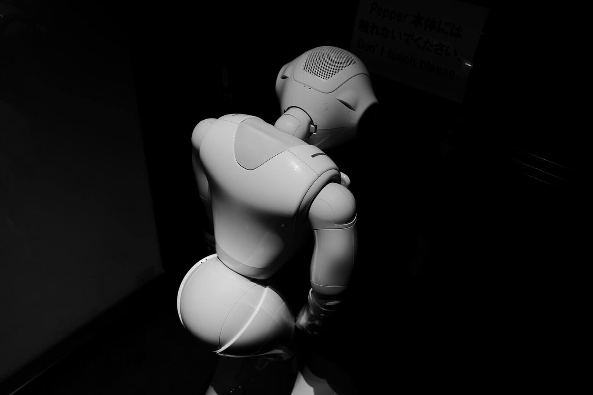

La tecnología avanza cada de vez más deprisa, hacia sistemas de inteligencia artificial (IA) más autónomos, dotados de capacidad de autoaprendizaje, adaptación, e incluso, capacidad para la toma de decisiones.

Este tipo de avances tecnológicos susceptibles de protección generan nuevas cuestiones a las que nuestro marco normativo existente debe dar respuestas.

Actualmente, existe un intenso debate jurídico acerca de las diversas implicaciones legales que plantea la intervención de sistemas de IA autónomos (o también denominados fuertes) en las organizaciones y en nuestra vida cotidiana, así como también en lo referente a la responsabilidad derivada de los daños causados por robots, cuestiones de carácter ético y moral, autoría o pertenencia de la titularidad de una determinada invención.

Con el objetivo de dar respuesta a la cuestión planteada inicialmente en el título de este artículo, referente a si es posible designar como inventor a un sistema de IA, conviene traer a colación el [caso DABUS](http://imagination-engines.com/iei_dabus.php).

DABUS es un sistema de inteligencia artificial creado por Stephen Thaler, CEO de una compañía llamada Imagination Engines. Dicho sistema, DABUS AI, fue alimentado con ingentes cantidades de datos de carácter general, y fue capaz de crear, por sí mismo, dos invenciones pertenecientes a diferentes campos técnicos.

En este sentido, <mark>su creador Stephen Thaler sostuvo que él no tenía conocimientos técnicos sobre las dos invenciones creadas de manera autónoma por el sistema DABUS y, tampoco había participado en el proceso inventivo de las mismas.  Por tanto, consideraba a DABUS como legítimo inventor de las invenciones</mark> que más adelante mencionaremos.

En noviembre de 2018, el equipo legal de expertos en patentes del proyecto denominado [Artificial Inventor Project](http://artificialinventor.com/patent-applications/) (AIP) fueron los encargados de presentar dos solicitudes de patentes ante la European Patent Office (EPO). Por un lado, presentaron la solicitud [EP18275163](https://register.epo.org/application?number=EP18275163&tab=main), relativa a un contenedor de alimentos y, por otro lado, la solicitud [EP18275174](https://register.epo.org/application?number=EP18275174), relativa a una lámpara diseñada para parpadear a un ritmo que imita los patrones de actividad neuronal que acompañan a la formación de las ideas. <mark>La particularidad que presentaban dichas solicitudes es que en ambas figuraba como inventor DABUS</mark>.

Con el propósito de conocer si otras oficinas de Propiedad Intelectual se encontraban a favor de designar como inventor a un sistema IA, el equipo de AIP presentó, además, solicitud de dichas patentes ante la Oficina de Propiedad Intelectual de Reino Unido (UKIPO) y ante la Oficina de Patentes y Marcas de Estados Unidos (UPSTO).

Ante esta cuestión, la EPO solicitó al Dr. Noam Shmetov, profesor de la Universidad Queen Mary de Londres, la elaboración de un informe relativo a la autoría de las invenciones generadas mediante IA (titulado "A study on inventorship in inventions involving AI activity"), <mark>en el cual concluía que un sistema de IA al carecer de personalidad</mark> (física o jurídica) no tenia capacidad para ser "titular" de un bien ni tampoco capacidad para ser parte en una relación laboral[^1].

Dicho lo anterior, no resulta sorprendente que el pasado 28 de enero de 2020, la EPO publicara la denegación de las dos patentes que designaban como inventor a DABUS, en base al art. 90.5 CPE al considerar que eran contrarias al art. 81 y la regla 19(1) CPE[^2]. <mark>En otras palabras, dicha denegación se basa en el incumplimiento por parte del solicitante del requisito de designación del inventor.</mark>

A este respecto, la EPO concluye que la designación de un inventor es obligatoria, ya que conlleva una serie de consecuencias jurídicas, en particular, garantizar que el inventor designado es el legítimo y que puede beneficiarse de los derechos vinculados a esta condición. <mark>Para ejercer estos derechos, el inventor debe tener una personalidad jurídica de la que no disfrutan los sistemas de IA.</mark>

En este mismo sentido, se pronunciaron la UKIPO[^3] y la UPSTO[^4] que optaron por rechazar la solicitud de dichas invenciones por motivos similares.

Dado que no existe una normativa armonizada a nivel europeo en esta materia, podría darse la posibilidad de que algún estado miembro de la CPE otorgue personalidad jurídica a un sistema de IA. Este tipo de cuestiones generan incertidumbre en aquellos que apuestan por invertir en el desarrollo de nuevas invenciones y podría llegar a desincentivar la innovación.

Por esta razón, resulta vital establecer un nuevo marco normativo armonizado que permita dar respuestas a las diferentes cuestiones legales que plantean los sistemas IA autónomos.

## Referencias

[^1]: Dr. Noam Stemtov (February 2019). A study on inventorship in inventions involving AI activity

[^2]: EPO publishes grounds for its decision to refuse two patent applications naming a machine as inventor [https://www.epo.org/news-events/news/2020/20200128.html](https://www.epo.org/news-events/news/2020/20200128.html)

[^3]: UKIPO Decision 074119 (Patents Acts 1977)
 
[^4]: AI cannot be recognised as an inventor, US rules. https://www.bbc.com/news/technology-52474250
